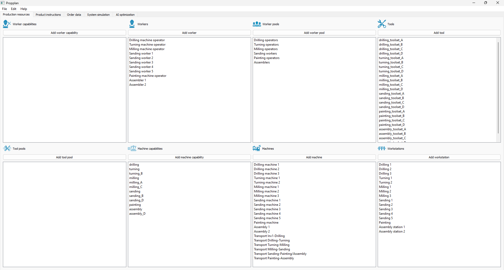
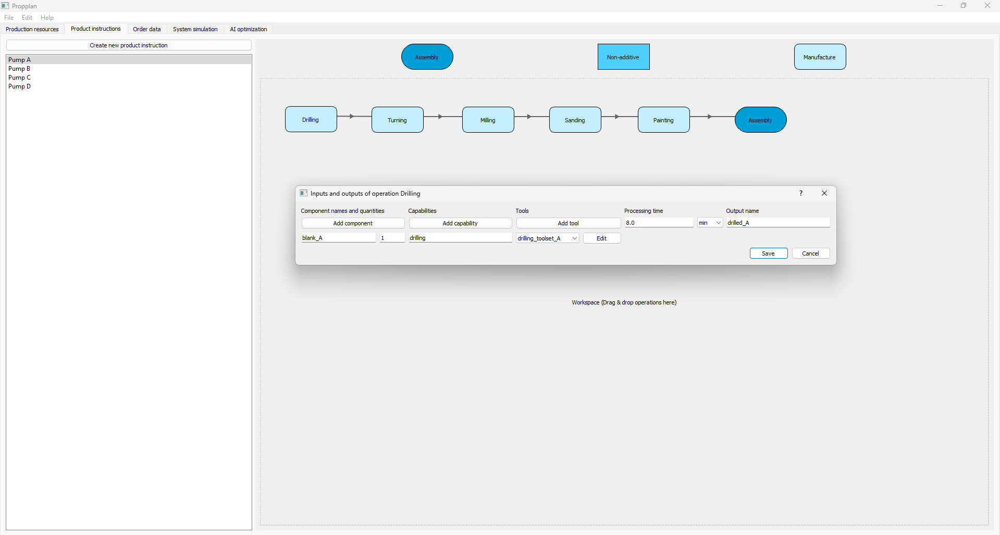
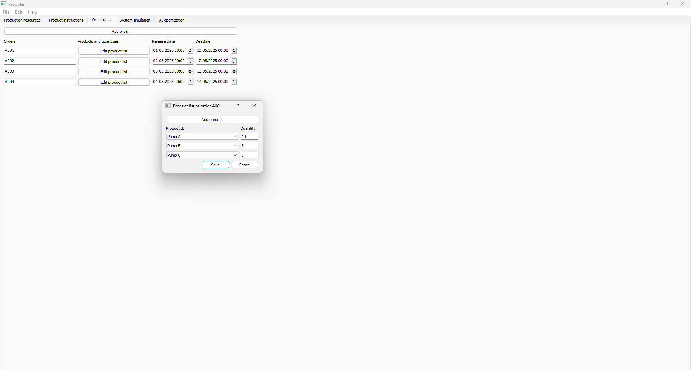
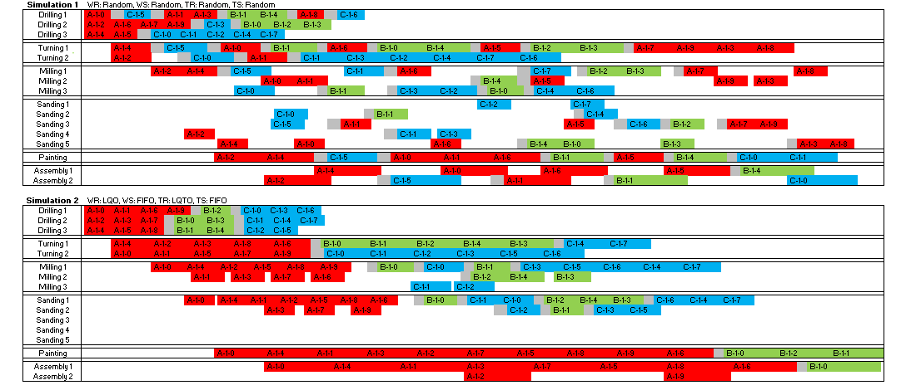
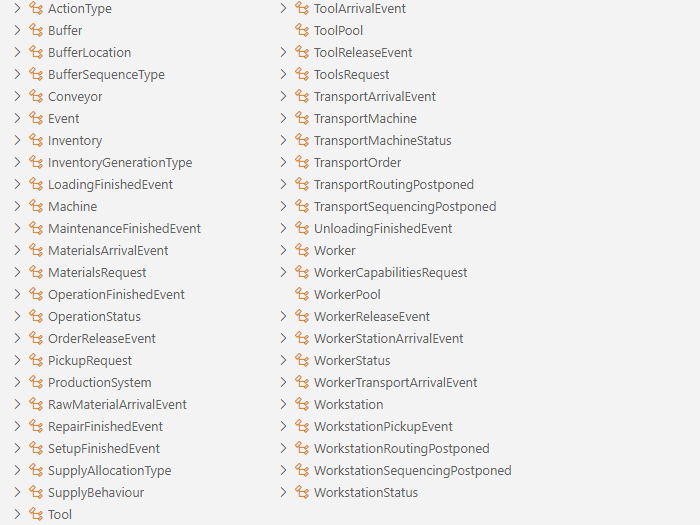
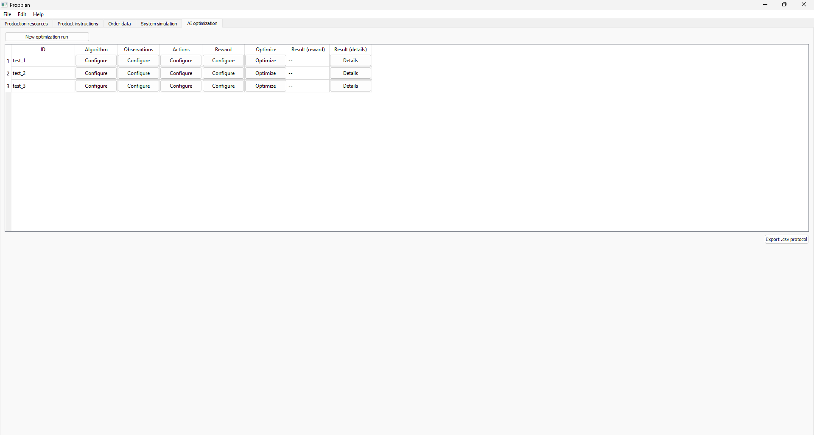

# PrOPPlan #

## Operational Production Program Planning through Self-Optimizing Material Flow Simulation Using Reinforcement Learning ##

The central task of operational production program planning (PPP) is to create a production schedule that determines which products are to be manufactured, in what quantities, and within which timeframes.
The production-related issues that arise in this process are typically addressed in a sequential manner using the expertise of human planners.
This approach leads to suboptimal solutions due to consecutive planning assumptions, as well as recurring effort for new and revised planning caused by variability-related changes or newly arrived orders.

For tasks in operational PPP that were originally human-centered, a methodology is being developed that uses discrete-event material flow simulations (MFS) along with the possibilities of artificial intelligence and machine learning, which have emerged over the past decade. This methodology aims to generate recommendations for optimal solutions to coherent planning tasks.
Specifically, the focus is on creating ideal production program plans, which involves the integrated solution of sequencing, lot sizing, detailed scheduling, and order release using intelligent methods.
The methodology is developed for scenarios defined by the project-accompanying committee (PA), generalized for broader use, and implemented into an IT tool alongside the project.

## Installation ##

The program is developed using __Python 3.12.7__. Please create a virtual environment for using Propplan.

Requirements:

```
json
numpy
matplotlib
PyQt5
gymnasium
torch
nevergrad
ray
seaborn
tensorboard
```

Once the requirements are installed, you should be able to run the main user interface from your IDE:

```
user_interface.py
```

## Main idea ##

Propplan consists of 5 tabs:

1) Production resources
2) Product instructions
3) Order data
4) System simulation
5) Experiments

To use reinforcement learning (RL), a simulation of the analyzed system is necessary. The required data are input in the tabs 1-4. Tabs 4 and 5 is where simulations can be run and performance of different control approaches examined.

### Production resources ###

To simulate a production system, at minimum, the information about workstations is necessary. The more detailed the provided data, the more added value from RL (theoretically!). We need to answer the question: _what_ do we use to fulfill customer orders?

Propplan accepts very detailed information about objects involved in the dynamic behaviour of a production system, however most of the fields in the Production Resources tab are optional and have default values for the assumption that these fields are neglected in modeling. The depth of detail that users choose is dependent on the necessary effort to collect information about the production system.



### Product instructions ###

We can plan or schedule operations if we know _what_ needs to be produced, _how_ it is to be produced, _what_ components or raw materials are used and _how long_ the operations take. Propplan uses precedence graphs to represent both work plans and BOMs in a convenient way.



### Order data ###

Production schedules will vary significantly depending on the "pressure" from the consumers, which manifests itself in the order data (_what_ needs to be produced and _till when_).



### System simulation ###

Once we've specified everything in the 3 previous tabs and a couple other system-wide properties in tab 4, we can see how the system will behave using various control strategies, ranging from simple heuristics to advanced RL models (once they are trained). Propplan doesn't visualize a physical layout of production systems but focuses on the schedules (dynamic Gantt charts) instead.

Here is how this will approximately look once we finish GUI implementation (this is work-in-progress):



To sum up the classes implemented in ```production_system.py```, the following figure provides an overview.



### Experiments ###

The idea is that separate simulation runs with specified control algorithms or models can be played in the tab 4 (System simulation), whereas tab 5 (Experiments) will use said simulation environment hundreds of thousands if not millions of times to train RL models. AI optimization tab will also keep track of training runs.



A special feature of our tool is the possibility to configure observation space, action space and reward function for RL or other control and planning approaches:


# License #

Shield: [![CC BY 4.0][cc-by-shield]][cc-by]

This work is licensed under a
[Creative Commons Attribution 4.0 International License][cc-by].

[![CC BY 4.0][cc-by-image]][cc-by]

[cc-by]: http://creativecommons.org/licenses/by/4.0/
[cc-by-image]: https://i.creativecommons.org/l/by/4.0/88x31.png
[cc-by-shield]: https://img.shields.io/badge/License-CC%20BY%204.0-lightgrey.svg
